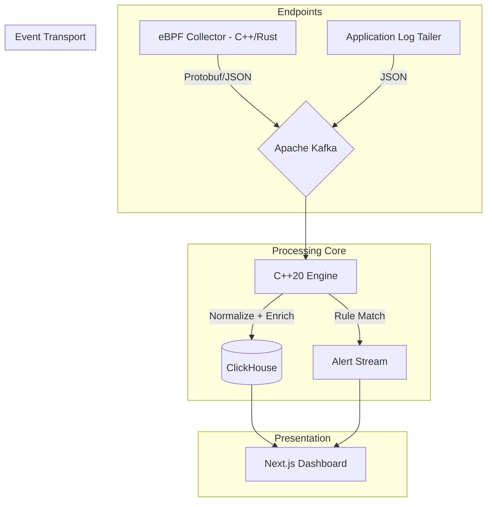

# Aegis-Vanguard SIEM

**Advanced Distributed Security Information and Event Management System**


## Abstract

Aegis-Vanguard is a distributed SIEM research and engineering project focused on high-throughput telemetry processing and low-latency security analytics. The system integrates kernel-level collection (eBPF), distributed event transport (Apache Kafka), stream processing and detection (C++20), and analytical persistence (ClickHouse), with a web-based investigation interface (Next.js). The architecture is designed to reduce ingestion bottlenecks, increase detection throughput, and support reproducible security experiments.

## Problem Statement

Conventional SIEM deployments frequently face three practical limitations:

1. High event volume causes ingestion and normalization bottlenecks.
2. Rule evaluation latency increases as detection logic scales.
3. Interactive threat investigation becomes expensive on non-OLAP storage.

Aegis-Vanguard addresses these constraints through a modular, performance-oriented pipeline and clearly separated system responsibilities.

## Objectives

1. Build a Linux-first telemetry pipeline using eBPF-based collection.
2. Implement scalable event transport with Kafka topics.
3. Develop a multithreaded C++20 processing engine for parsing, enrichment, and rule matching.
4. Persist and query large event datasets efficiently using ClickHouse.
5. Provide a dashboard for alert visibility and forensic workflows.
6. Enable deterministic validation through attack simulation and rule tests.

## Scope

### In Scope

- Endpoint telemetry collection for process and network activity.
- Stream-based event ingestion and transformation.
- Rule-based detection workflow with Sigma-compatible structure.
- Analytical storage and operational dashboard visualization.
- CI checks for build integrity and rule syntax validation.

### Out of Scope (Current Phase)

- Full production hardening and enterprise tenancy.
- Cross-region disaster recovery and advanced HA guarantees.
- Complete SOC case-management functionality.

## System Architecture



## Technology Stack

| Component | Technology |
| --- | --- |
| Languages | C++20, Rust (collector path), TypeScript (UI), Python (tooling) |
| Kernel Observation | eBPF, libbpf |
| Messaging | Apache Kafka |
| Storage | ClickHouse, Redis (optional cache) |
| Frontend | Next.js, TailwindCSS, Recharts |
| DevOps | Docker, Docker Compose, CMake, GitHub Actions |

## Repository Structure

```text
aegis-vanguard/
├── collector/                  # Module 1: telemetry collection (C++/eBPF)
│   ├── src/
│   ├── ebpf/
│   ├── include/
│   ├── tests/
│   └── CMakeLists.txt
├── engine/                     # Module 2: parsing, enrichment, detection (C++20)
│   ├── src/
│   │   ├── pipeline/
│   │   ├── detection/
│   │   └── enrichment/
│   ├── include/
│   ├── third_party/
│   └── CMakeLists.txt
├── dashboard/                  # Module 3: analyst interface (Next.js)
│   ├── src/
│   └── package.json
├── deploy/                     # Infrastructure manifests and bootstrap assets
│   ├── docker-compose.yml
│   ├── env/.env.example
│   ├── clickhouse/init/
│   ├── kafka/init/
│   └── grafana/provisioning/
├── config/                     # Runtime configuration templates
│   ├── dev/
│   └── prod/
├── rules/                      # Detection rules and validation assets
│   ├── windows/
│   ├── linux/
│   ├── network/
│   └── validation/
├── shared/proto/               # Shared event contracts
├── tests/                      # Cross-module integration and e2e suites
│   ├── integration/
│   ├── e2e/
│   └── fixtures/
├── scripts/                    # Validation and simulation tools
├── docs/adr/                   # Architecture decision records
├── .github/workflows/          # CI definitions
├── CMakeLists.txt
└── CMakePresets.json
```

## Prerequisites

- Docker Engine + Docker Compose v2
- CMake 3.20+
- Ninja or Make
- C++ compiler with C++20 support (GCC, Clang, or MSVC)
- Python 3.10+
- Node.js 20+

## Reproducible Setup

### 1) Start local infrastructure

```bash
cp deploy/env/.env.example deploy/env/.env
docker compose --env-file deploy/env/.env -f deploy/docker-compose.yml up -d
```

PowerShell alternative:

```powershell
Copy-Item deploy/env/.env.example deploy/env/.env
docker compose --env-file deploy/env/.env -f deploy/docker-compose.yml up -d
```

### 2) Build native modules

```bash
cmake --preset debug
cmake --build --preset build-debug
```

### 3) Validate rule syntax

```bash
pip install pyyaml
python scripts/validate_rules.py
```

### 4) Run dashboard in development mode

```bash
cd dashboard
npm install
npm run dev
```

## Methodology and Data Flow

1. Collect endpoint activity from kernel and host sources.
2. Normalize into a shared event contract.
3. Publish into Kafka topic `siem.events`.
4. Consume and process events in the engine pipeline.
5. Write processed events and alerts to ClickHouse tables (`raw_events`, `alerts`).
6. Render alert and timeline views in the dashboard.

## Validation Strategy

- `collector/tests`: unit tests for collection and serialization behavior.
- `engine` module tests: parser, matcher, and enrichment tests.
- `tests/integration`: collector -> kafka -> engine -> clickhouse flow tests.
- `tests/e2e`: attack simulation to alert-generation scenarios.
- CI baseline: native build + rule syntax checks.

## Current Limitations

- Collector and engine implementations are scaffold-first and still under incremental development.
- Rule validation currently focuses on syntax; semantic validation is planned.
- Production observability, fault-tolerance, and multi-tenant features are roadmap items.

## Roadmap

1. Phase 1: Telemetry ingestion and ClickHouse persistence.
2. Phase 2: Sigma-compatible matching and severity scoring.
3. Phase 3: Forensics-oriented dashboard workflows.
4. Phase 4: Multi-tenant controls, RBAC, and retention policies.

## Documentation Index

- `docs/api_spec.md`: event and storage contracts.
- `docs/adr/`: architecture decisions and rationale.
- `deploy/README.md`: local deployment notes.

## Contribution Guidelines

1. Create a feature branch.
2. Ensure build and validation checks pass locally.
3. Submit a pull request with implementation summary and test evidence.

## Ethics and Legal Notice

This repository is intended for academic, learning, and authorized security research purposes only. Do not use this software for unauthorized access, disruption, or offensive activity.
