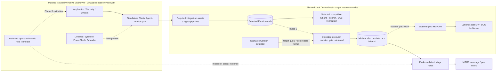

# AEGIS-VANGUARD

AEGIS-VANGUARD is a planned, fully local SIEM-like SOC learning lab. Its goal is to demonstrate a portfolio-scale detection lifecycle: collect real telemetry, normalize it to ECS, convert Sigma rules into executable detections, create alerts, triage evidence, investigate related events, map results to MITRE ATT&CK, and document coverage and gaps.

This is **not** a production SIEM, commercial SIEM, commercial EDR, enterprise SOC platform, or claim of enterprise-scale coverage. The repository is new and currently contains documentation only: no lab phase, runtime service, detection, alert, metric, dashboard, or evidence artifact has been implemented or verified.

The planned core question is:

> Given one approved Atomic Red Team test executed against an isolated Windows VM, can the local pipeline collect the relevant telemetry, alert on it, and produce enough evidence to explain what was detected or missed?

## Planned Core Flow

```text
Phase 1
  Application / Security / System event logs
  -> standalone Elastic Agent selected at the Phase 1 version gate
  -> required integration assets and ingest pipelines
  -> mutually compatible Elasticsearch
  -> mutually compatible Kibana search and ECS verification

Phase 2
  one initial Sigma rule
  -> pySigma/sigma-cli + backend conversion
  -> separately selected detection executor
  -> minimal alert persistence

Phase 3
  approved Atomic Red Team test
  -> complete evidence bundle for one rule-scenario pair
  -> first result eligible for Live verified

Post-MVP
  expand to 3-5 rules
  -> coverage and gap analysis
  -> additional telemetry sources
  -> optional alert-triage API and dashboard
```

Phase 1 will select an exact mutually compatible Elastic Stack and Elastic Agent version at its version gate. Elastic `9.x` is the target release family, not a selected exact version.

## No Fixture-Based Capability Claims

Fixtures and unit tests are planned only for syntax, parsing, conversion, and isolated logic checks. They must never be cited as detection evidence.

- A unit result may receive `Unit tested`; it cannot prove a runtime detection.
- Phase 1 may reach `Runtime verified` only for telemetry ingestion and ECS verification after all relevant readiness gates pass, real Application/Security/System events are collected, source timestamps and host/Agent identity and planned ECS field groups are checked, and the corresponding evidence artifact is reviewed.
- Phase 1 ingestion verification does not prove a detection rule works. Phase 1 cannot claim detection, alert generation, MITRE coverage, or `Live verified`.
- Phase 2 may reach at most `Runtime verified` through controlled runtime smoke or manual validation on real telemetry; it cannot receive `Live verified` or prove evidence-backed detection coverage.
- Only a specific rule-scenario pair exercised by an approved Atomic Red Team test with a complete evidence bundle may receive `Live verified`.
- One scenario must never be generalized into a whole phase, platform, rule collection, or MITRE technique being live verified.
- Screenshots are supporting evidence only and require links to the corresponding query, source event, and scenario run.

## Status Model

Capability status and metric status are separate.

### Capability statuses

| Status | Meaning |
| --- | --- |
| `Future` | No implementation artifact exists. |
| `Implemented` | An artifact or configuration exists and is reviewable; runtime behavior is not yet proven. |
| `Unit tested` | Syntax, parsing, conversion, or isolated logic has been checked; this is not runtime or detection evidence. |
| `Runtime verified` | A controlled runtime smoke or manual validation has run on real telemetry; this is not evidence-backed detection coverage. |
| `Live verified` | One specific rule-scenario pair has been validated by an approved Atomic Red Team test with a complete evidence bundle. |

### Metric statuses

| Status | Meaning |
| --- | --- |
| `Not measured yet` | No sufficient evidence set exists for the metric. |
| `Measured` | The metric has a documented method, sample scope, and linked evidence. |

## Planned Demonstration Targets

- Collect Application, Security, and System logs from an isolated Windows victim VM through one standalone Elastic Agent whose exact version is selected with mutually compatible Elastic Stack versions at the Phase 1 version gate.
- Install and verify the required Elastic integration assets, ingest pipelines, and index templates before accepting ingestion as valid.
- Verify searchable real events and planned ECS field groups in Elasticsearch and Kibana.
- Express detection logic as Sigma rules and use `pySigma`/`sigma-cli` with a backend to convert them into target queries or deployable formats.
- Run converted detections through a separately selected executor that manages scheduling, query windows, deduplication, and alert persistence.
- Validate one initial rule through the first complete Atomic-backed evidence loop before expanding to 3-5 rules.
- Produce SOC-style triage notes, MITRE ATT&CK mappings, coverage entries, and gap notes only from linked scenario evidence.
- Add Sysmon, PowerShell, Defender, Suricata, Wazuh, and optional Kafka only after the MVP gate that applies to them.
- Optionally add a small alert-triage API and SOC dashboard after MVP; these components do not block the first evidence-backed detection loop.

## Planned SIEM Capability Map

| SIEM capability | Planned AEGIS-VANGUARD component |
| --- | --- |
| Log/telemetry collection | Standalone Elastic Agent for Application, Security, and System; later planned sources include Sysmon, PowerShell, Defender, Suricata, and Wazuh |
| Normalization | Elastic integration assets and ingest pipelines, with mappings verified and documented in planned `normalization/ecs_mapping.md` |
| Detection format and conversion | Sigma rule format converted by `pySigma`/`sigma-cli` and a compatible backend |
| Detection execution | An unresolved Phase 2 architecture decision between compatible Elastic Security detection rules and a custom scheduled executor |
| Alert generation | Minimal alert persistence created by the selected executor from live detection results |
| Triage and investigation | Evidence-linked notes first; optional post-MVP API and SOC dashboard later |
| Threat mapping | MITRE ATT&CK technique IDs linked across scenario, rule, alert, and coverage entry |
| Coverage and gap reporting | Planned `mitre/coverage.md` populated only from complete scenario evidence bundles |

`pySigma` and `sigma-cli` are conversion tooling. They do not by themselves monitor Elasticsearch, schedule queries, suppress duplicates, or create alert records.

## Target Architecture

The following diagram is a planned target architecture, not a deployed system.


```mermaid
flowchart LR
  subgraph victim["Planned isolated Windows victim VM - VirtualBox host-only network"]
    logs["Application / Security / System"]
    agent["Standalone Elastic Agent - version gate"]
    laterTelemetry["Deferred: Sysmon / PowerShell / Defender"]
    atomic["Deferred: approved Atomic Red Team test"]
  end

  subgraph host["Planned local Docker host - staged resource modes"]
    assets["Required integration assets / ingest pipelines"]
    es[("Selected Elasticsearch")]
    kibana["Selected compatible Kibana - search / ECS verification"]
    conversion["Sigma conversion - deferred"]
    executor["Detection executor decision gate - deferred"]
    alerts[("Minimal alert persistence - deferred")]
    api["Optional post-MVP API"]
    dashboard["Optional post-MVP SOC dashboard"]
  end

  logs --> agent --> assets --> es --> kibana
  laterTelemetry -. later phases .-> agent
  atomic -. Phase 3 validation .-> logs
  es -. Phase 2 .-> executor
  conversion -. target query / deployable format .-> executor
  executor --> alerts
  alerts -. optional post-MVP .-> api
  api --> dashboard
  alerts --> triage["Evidence-linked triage notes"]
  atomic -. missed or partial evidence .-> triage
  triage --> report["MITRE coverage / gap notes"]
```

## Standalone Elastic Agent and Fleet Boundary

- Phase 1 plans one standalone Elastic Agent. Its policy and binary lifecycle must be managed manually.
- Fleet-managed Elastic Agent enrollment and Fleet Server are deferred. Fleet Server is not a prerequisite for the standalone flow.
- Kibana Integrations/Fleet UI may be used to install integration package assets, create an Agent policy, and export a standalone policy without enrolling the Agent in Fleet Server.
- Required ingest pipelines, index templates, and other integration assets must exist before ingestion is accepted as valid.
- The exact mutually compatible Elastic Stack and Elastic Agent versions and their version-specific workflow must be confirmed at the Phase 1 version gate; this document does not assume unverified version-specific behavior.

## Planned Environment

| Component | Planned location | Boundary |
| --- | --- | --- |
| Windows victim VM | Local VirtualBox host-only network | No bridged/public networking during scenarios; Phase 1 starts with Application, Security, and System |
| Elastic Stack and detection workflow | Local Docker host | Services run only in the resource mode needed for the approved task |
| Optional backend/dashboard | Local Docker host, post-MVP only | No public exposure; does not block MVP |

No cloud or publicly exposed attack environment is planned.

## Planned Resource Modes

The values below are planning estimates for a 16 GB RAM laptop. They are not measurements and must be replaced or qualified by the Phase 0/1 preflight results.

| Component | Planning estimate | Notes |
| --- | --- | --- |
| Host OS and tools | ~3 GB RAM | Validate during preflight |
| Windows victim VM | ~4 GB RAM | Planned only for ingestion and scenario sessions |
| Selected Elasticsearch + Kibana | ~3.5-4.5 GB RAM | Validate exact compatibility and resource use before startup |
| Suricata | ~1 GB RAM | Post-MVP estimate |
| Wazuh manager + indexer | ~4 GB RAM | Planned separate session from Elastic Stack |
| Kafka | ~1.5-2 GB RAM | Optional stretch estimate |

| Mode | Planned use | Planned running components |
| --- | --- | --- |
| A - Rule development | Sigma syntax/conversion work | No live services required |
| B - Live ingestion | Phase 1 telemetry and ECS verification | Victim VM + Elastic Stack |
| C - Scenario session | Approved Phase 3 Atomic validation | Victim VM + Elastic Stack + selected detection executor |
| D - Evidence review | Review stored alerts and evidence | Elastic Stack; optional API/dashboard only after MVP |
| E - Wazuh session | Post-MVP Wazuh work | Wazuh stack only |
| F - Kafka session | Optional stretch work | Kafka and only required producer/consumer components |

Future Docker Compose profiles may support these modes, but no Compose configuration currently exists or enforces them.

## Current Evidence-Backed Status

The repository currently contains only the documentation baseline and agent instructions. It contains no source code, runtime configuration, tests, phase deliverables, or evidence artifacts.

| Area | Capability status | Planned evidence/artifact |
| --- | --- | --- |
| Phase 0 local lab foundation | `Future` | Planned `docs/phase-0-environment.md` |
| Phase 1 telemetry ingestion and ECS verification | `Future` | Planned `normalization/ecs_mapping.md` and `docs/phase-1-verification.md` |
| Phase 2 Sigma conversion, execution, and alert persistence | `Future` | Planned initial rule and `docs/phase-2-verification.md` |
| Phase 3 first Atomic-backed rule-scenario validation | `Future` | Planned scenario runbook and `docs/phase-3-scenario-log.md` |
| Phase 4 MITRE coverage and gap analysis | `Future` | Planned `mitre/coverage.md` |
| Optional post-MVP API/dashboard | `Future` | No artifact planned before MVP |
| Suricata, Wazuh, and Kafka | `Future` | Later gated deliverables |

All coverage, false-positive-rate, MTTD, and gap-closure metrics are `Not measured yet`.

## Planned Operating Flow

1. Complete and evidence the Phase 0 isolation and resource prerequisites.
2. Pass the Phase 1 version, resource, network, TLS, secret-handling, logging, and rollback gates.
3. Ingest and verify Application, Security, and System telemetry through one standalone Elastic Agent; only the ingestion/ECS capability may then become `Runtime verified`.
4. Use reviewed Phase 1 telemetry evidence to pass the initial-rule selection gate, select the Phase 2 executor, convert the rule, run controlled runtime validation, and persist minimal alerts.
5. Review the telemetry-rule-scenario alignment, obtain approval for the exact Atomic Red Team test run, execute it, and produce the first complete rule-scenario evidence bundle.
6. Create the first evidence-backed coverage entry and gap/validation note.
7. After MVP, expand to 3-5 rules and consider additional telemetry and the optional API/dashboard workstream.

## Ethics and Safety

- Attack emulation requires explicit approval for the exact run and is limited to the isolated host-only lab.
- The victim VM must never use bridged/public networking for scenario execution.
- Elasticsearch, Kibana, APIs, and dashboards must never be exposed publicly.
- No capability status or metric may be upgraded without its required linked evidence.
- Credentials, tokens, personal data, and sensitive machine identifiers must be redacted from repository evidence.

## What This Project Does Not Claim

- A production or managed SIEM.
- A commercial SIEM or EDR.
- An enterprise SOC platform.
- Enterprise-scale telemetry or detection coverage.
- Any implemented or runtime-verified lab phase.
- Any detection result, coverage value, or other metric without linked evidence.

## Documentation Ownership

- `README.md`: project identity, current repository state, target architecture summary, status model, resource modes, safety boundaries, and roadmap link.
- `PROJECT_PLAN.md`: roadmap, gates, dependencies, success criteria, evidence requirements, and future work.
- `AGENTS.local.md`: project-specific agent behavior and safety boundaries.
- `CONTEXT.md`: non-authoritative working state, approved decisions, blockers, changed files, validation results, and next approved step.

## Roadmap

See `PROJECT_PLAN.md`.
