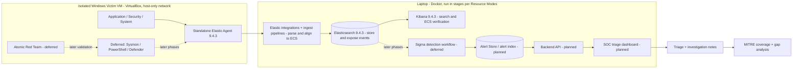

# AEGIS-VANGUARD

AEGIS-VANGUARD is a fully local SIEM-like SOC lab and mini-SIEM-style SOC detection platform. It is designed to demonstrate the complete SIEM/SOC detection lifecycle at portfolio scale: collect telemetry, normalize it to ECS, apply Sigma rules, generate alerts, triage evidence, investigate related events, map results to MITRE ATT&CK, produce evidence-backed coverage notes, and analyze detection gaps.

This is **not** a production SIEM, **not** a commercial SIEM, **not** a commercial EDR, **not** an enterprise SOC platform, and **not** a claim of enterprise-scale coverage. It is a fresher/portfolio project designed to answer one question honestly: *given a specific attack technique, executed for real in an isolated lab, what does my pipeline actually detect, what evidence supports that alert, and what does it miss?*

```text
Phase 1 baseline Windows event logs (Application, Security, System)
  -> standalone Elastic Agent 9.4.3
  -> Elastic integrations and ingest pipelines parse and align events to ECS
  -> Elasticsearch 9.4.3 stores and exposes events
  -> Kibana 9.4.3 search and ECS verification

Later phases
  -> add Sysmon, PowerShell, and Defender telemetry
  -> apply Sigma detection rules and generate alerts
  -> run controlled Atomic Red Team validation
  -> triage evidence, update MITRE coverage, and document gaps
```

## Design Principle: No Fixture-Based Capability Claims

The previous iteration of this project relied on hand-crafted fixture events to "verify" detection logic, which proved the code could parse JSON it was told to expect, not that it could detect anything real. This version fixes that at the root:

- **Every detection claim requires a live, timestamped run** against real Sysmon/network telemetry generated by an actual Atomic Red Team execution. No coverage number, no "verified" label, and no alert screenshot is used as evidence unless it traces back to a real attack execution log.
- Small unit tests **do** exist for parsing/rule-syntax correctness (standard engineering hygiene, and real detection-engineering teams do this too). These are explicitly labeled `Unit tested` and are **never** used as evidence of detection capability. Only `Live verified` counts as that.

## What This Project Demonstrates

- Telemetry ingestion from an isolated Windows victim VM, starting with **Application, Security, and System through one standalone Elastic Agent 9.4.3**; Sysmon is deferred.
- Elastic integrations and ingest pipelines parse and align events to **Elastic Common Schema (ECS)**; Elasticsearch stores and exposes them, and Kibana provides search and ECS verification.
- Detection logic written as **Sigma rules**, compiled with `pySigma`, and run against live telemetry.
- Alert generation from Sigma matches against real events, not replayed fixtures.
- A SOC-style triage workflow for reviewing alert context, severity, source telemetry, linked rule, and MITRE technique.
- An investigation/evidence trail that links attack execution time, telemetry arrival time, alert time, rule id, and supporting events.
- A **MITRE ATT&CK** coverage matrix populated only from real scenario runs.
- Gap analysis and rule improvement notes for missed or weak detections.
- Controlled, isolated **Atomic Red Team** executions as the only accepted source of "this rule works" evidence.
- Secondary telemetry sources, including **Suricata** (network IDS) and **Wazuh** (host log/FIM), added only after the first live-verified detection loop is proven.
- A planned small backend API and dashboard for SOC-style alert triage and investigation.

## SIEM Capability Map

| SIEM capability | AEGIS-VANGUARD component |
| --- | --- |
| Log/telemetry collection | Planned standalone Elastic Agent path for Application, Security, and System; Sysmon, PowerShell, Defender, Suricata, and Wazuh are later planned sources |
| Normalization | Planned Elastic integrations and ingest pipelines parse and align real source events to ECS; Elasticsearch stores and exposes the events, and Kibana is used for search and ECS verification |
| Detection | Planned Sigma detection workflow using `pySigma` against live Elasticsearch data |
| Alert generation | Planned alert store / alert index populated only from live detection results |
| Triage | Planned backend API and SOC triage dashboard for alert review |
| Investigation | Triage notes linked to source events, rule id, timestamps, and supporting evidence |
| Threat mapping | MITRE ATT&CK technique ids carried from scenario to rule, alert, and coverage entry |
| Coverage/gap reporting | `mitre/coverage.md` and gap notes populated only from real scenario evidence bundles |

## Architecture


```mermaid
flowchart LR
  subgraph victim[Isolated Windows Victim VM - VirtualBox, host-only network]
    logs[Application / Security / System]
    agent[Standalone Elastic Agent 9.4.3]
    laterTelemetry[Deferred: Sysmon / PowerShell / Defender]
    atomic[Atomic Red Team - deferred]
  end

  subgraph host[Laptop - Docker, run in stages per Resource Modes]
    ingest[Elastic integrations + ingest pipelines - parse and align to ECS]
    es[(Elasticsearch 9.4.3 - store and expose events)]
    kibana[Kibana 9.4.3 - search and ECS verification]
    sigma[Sigma detection workflow - deferred]
    alerts[(Alert Store / alert index - planned)]
    api[Backend API - planned]
    dashboard[SOC triage dashboard - planned]
  end

  logs --> agent --> ingest --> es
  laterTelemetry -. later phases .-> agent
  atomic -. later validation .-> laterTelemetry
  es --> kibana
  es -. later phases .-> sigma
  sigma --> alerts
  alerts --> api
  api --> dashboard
  dashboard --> triage[Triage + investigation notes]
  triage --> report[MITRE coverage + gap analysis]
```

The Phase 1 telemetry path is Application, Security, and System through one standalone Elastic Agent and Elastic integrations/ingest pipelines into Elasticsearch, with Kibana used for search and ECS verification. Fleet remains a future option for centralized management or multiple endpoints. Sysmon and other telemetry or detection components remain deferred. See `PROJECT_PLAN.md`.

## Environment

| Component | Where it runs | Why |
| --- | --- | --- |
| Windows victim VM (standalone Elastic Agent; later Sysmon and Atomic Red Team target) | **Local VirtualBox**, host-only isolated network | Needs a real Windows host and true network isolation; no cloud VPS can safely or cheaply run this |
| Elastic stack, Sigma detection workflow, planned backend, planned dashboard | **Local Docker**, same laptop | Runs in stages per Resource Mode, never all containers alive at once (see below) |

No cloud hosting is used. This keeps the isolated-lab safety guarantee simple: nothing attack-related ever touches the public internet, and the project does not depend on a promotional cloud credit with an uncertain expiry.

## Resource Modes (16GB RAM laptop budget)

Only run what the current task needs. Approximate RAM cost per component:

| Component | ~RAM | Notes |
| --- | --- | --- |
| Host OS + tools | 3GB | Always on |
| Windows victim VM | 4GB | On only during Phase 1+/scenario sessions |
| Elasticsearch 9.4.3 + Kibana 9.4.3 | 3.5-4.5GB planned | Verify the actual budget during the Phase 1 preflight; start manually only for the required session |
| Suricata | ~1GB | Can run alongside Elastic stack after the first live loop is proven |
| Wazuh manager + indexer | ~4GB | **Do not run alongside the Elastic stack**; stop one before starting the other |
| Kafka | ~1.5-2GB | Optional stretch goal, added last, its own session |

| Mode | Use for | What's running |
| --- | --- | --- |
| A - Rule development | Writing/unit-testing Sigma rules | Nothing live; `pySigma --check` only |
| B - Live ingestion dev | Verifying ECS mapping against real, non-fixture events | Victim VM + Elastic stack |
| C - Scenario session | Running Atomic Red Team and measuring detection | Victim VM + Elastic stack + Sigma rules active |
| D - Planned SOC triage demo | Reviewing alerts and investigation evidence | Elastic stack + planned backend + planned dashboard (VM can be off) |
| E - Wazuh session | Testing Wazuh adapter | Wazuh stack only (Elastic stack stopped) |
| F - Kafka session (stretch) | Testing event-streaming layer | Added only after the core SIEM/SOC loop is proven |

## Current Implementation Status

This repository currently contains the completed Phase 0 lab foundation with linked evidence, plus the project documentation and roadmap. Phase 1 implementation remains future work; no detection, alert, coverage, or dashboard capability is claimed until the corresponding live evidence exists.

| Label | Meaning |
| --- | --- |
| `Implemented` | Code/config exists and is reviewable. |
| `Unit tested` | Parsing/rule-syntax correctness checked against sample data; **not** detection evidence. |
| `Live verified` | Ran against real telemetry from a real Atomic Red Team execution, with a logged timestamped result. |
| `Future` | Planned, not started. |
| `Not measured yet` | Metric needs real scenario logs before it can be reported. |

| Area | Status | Planned evidence/artifact |
| --- | --- | --- |
| Local SIEM lab foundation | `Implemented` | `docs/phase-0-environment.md` |
| Live telemetry ingestion + ECS verification | `Future` | `normalization/ecs_mapping.md`, `docs/phase-1-verification.md` |
| Sigma detection + alert generation | `Future` | `rules/*.yml`, `docs/phase-2-verification.md` |
| SOC triage workflow + first Atomic Red Team validation | `Future` | `scenarios/`, `docs/phase-3-scenario-log.md` |
| MITRE coverage matrix + gap analysis | `Not measured yet` | `mitre/coverage.md`, populated only after scenario runs |
| Suricata / Wazuh adapters | `Future` | Later phases, gated behind the first live-verified detection loop |
| Kafka layer | `Future` | Optional stretch goal, added last |

## Planned Operating Flow

The runnable quickstart will be added only after the matching files and scripts exist. The intended workflow is:

1. Build the isolated local lab foundation.
2. Confirm Application, Security, and System telemetry reaches Elasticsearch through one standalone Elastic Agent 9.4.3 and the approved Elastic integrations/ingest pipelines.
3. Confirm searchability and ECS verification in Kibana, and document mapping decisions without making a detection, alerting, coverage, or `Live verified` claim.
4. Add Sigma rules and generate alerts from live events.
5. Run Atomic Red Team scenarios on the isolated victim VM.
6. Triage alerts, investigate supporting events, and update MITRE coverage and gap notes.

## Ethics and Safety

- All attack emulation runs only inside an isolated, host-only VirtualBox network: never on shared Wi-Fi, never cloud-hosted, never against third-party systems.
- No detection metric is published without a linked scenario log containing attack timestamp, telemetry timestamp, alert timestamp, and rule id.
- Unit tests are engineering hygiene, not proof of detection capability; they are never cited as detection evidence.

## What This Project Does Not Claim

- A production SIEM or managed detection platform.
- A commercial SIEM.
- A commercial EDR.
- An enterprise SOC platform.
- Enterprise-scale telemetry or detection coverage.
- Any detection metric without a linked, timestamped live scenario run.
- Full feature parity with a real SOC team's toolset; this is a one-engineer learning lab.

## Roadmap

See `PROJECT_PLAN.md`.
