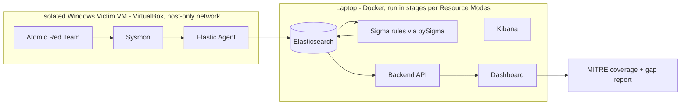

# AEGIS-VANGUARD

A fully local SOC detection lab built to prove real detection engineering skill: real endpoint telemetry (not replayed fixtures), ECS-normalized data, Sigma detection rules, and MITRE ATT&CK coverage measured against actual controlled attack executions via Atomic Red Team.

This is **not** a production SIEM, **not** a commercial EDR, and **not** a claim of enterprise-scale coverage. It is a fresher/portfolio project designed to answer one question honestly: *given a specific attack technique, executed for real in an isolated lab, what does my pipeline actually detect — and what does it miss?*

```text
Atomic Red Team execution (isolated Windows victim VM)
  -> Sysmon telemetry -> Elastic Agent
  -> ECS-normalized event (Elasticsearch)
  -> Sigma detection rule
  -> alert (MITRE ATT&CK mapped)
  -> dashboard
  -> gap analysis (what was missed, why)
  -> rule improvement
```

## Design Principle: No Fixture-Based Capability Claims

The previous iteration of this project relied on hand-crafted fixture events to "verify" detection logic — which proved the code could parse JSON it was told to expect, not that it could detect anything real. This version fixes that at the root:

- **Every detection claim requires a live, timestamped run** against real Sysmon/network telemetry generated by an actual Atomic Red Team execution. No coverage number, no "verified" label, and no alert screenshot is used as evidence unless it traces back to a real attack execution log.
- Small unit tests **do** exist for parsing/rule-syntax correctness (standard engineering hygiene — real detection-engineering teams do this too). These are explicitly labeled `Unit tested` and are **never** used as evidence of detection capability. Only `Live verified` counts as that.

## What This Project Demonstrates

- Real endpoint telemetry collection via **Sysmon + Elastic Agent** on an isolated Windows victim VM.
- Telemetry normalized to the **Elastic Common Schema (ECS)** — the same schema used in real SOC tooling.
- Detection logic written in **real Sigma rule syntax**, compiled with `pySigma`.
- **MITRE ATT&CK** technique mapping carried from rule → alert → coverage matrix.
- Controlled, isolated **Atomic Red Team** executions as the only accepted source of "this rule works" evidence.
- Secondary telemetry sources — **Suricata** (network IDS) and **Wazuh** (host log/FIM) — added after the core loop is proven, feeding the same ECS pipeline.
- A small backend API + dashboard for alert triage.
- A MITRE coverage and gap-analysis report populated only from real scenario runs.

## Architecture


```mermaid
flowchart LR
  subgraph victim[Isolated Windows Victim VM - VirtualBox, host-only network]
    atomic[Atomic Red Team]
    sysmon[Sysmon]
    agent[Elastic Agent]
  end

  subgraph host[Laptop - Docker, run in stages per Resource Modes]
    es[(Elasticsearch)]
    kibana[Kibana]
    sigma[Sigma rules via pySigma]
    api[Backend API]
    dashboard[Dashboard]
  end

  atomic --> sysmon --> agent --> es
  es --> sigma --> es
  es --> api --> dashboard --> report[MITRE coverage + gap report]
```

Suricata and Wazuh join as additional ECS-mapped sources in later phases — see `PROJECT_PLAN.md`.

## Environment

| Component | Where it runs | Why |
| --- | --- | --- |
| Windows victim VM (Sysmon, Atomic Red Team target) | **Local VirtualBox**, host-only isolated network | Needs a real Windows host and true network isolation — no cloud VPS can safely or cheaply run this |
| Elastic stack, Sigma engine, backend, dashboard | **Local Docker**, same laptop | Runs in stages per Resource Mode — never all containers alive at once (see below) |

No cloud hosting is used. This keeps the isolated-lab safety guarantee simple (nothing attack-related ever touches the public internet) and avoids any dependency on a promotional cloud credit with an uncertain expiry.

## Resource Modes (16GB RAM laptop budget)

Only run what the current task needs. Approximate RAM cost per component:

| Component | ~RAM | Notes |
| --- | --- | --- |
| Host OS + tools | 3GB | Always on |
| Windows victim VM | 4GB | On only during Phase 1+/scenario sessions |
| Elasticsearch + Kibana + Fleet | 4–5GB | On during ingestion/detection dev and scenario sessions |
| Suricata | ~1GB | Can run alongside Elastic stack |
| Wazuh manager + indexer | ~4GB | **Do not run alongside the Elastic stack** — stop one before starting the other |
| Kafka | ~1.5–2GB | Optional stretch goal, added last, its own session |

| Mode | Use for | What's running |
| --- | --- | --- |
| A — Rule development | Writing/unit-testing Sigma rules | Nothing live — `pySigma --check` only |
| B — Live ingestion dev | Verifying ECS mapping against real (not fixture) events | Victim VM + Elastic stack |
| C — Scenario session | Running Atomic Red Team, measuring detection | Victim VM + Elastic stack + Sigma rules active |
| D — Dashboard demo | Reviewing/triaging alerts | Elastic stack + backend + dashboard (VM can be off) |
| E — Wazuh session | Testing Wazuh adapter | Wazuh stack only (Elastic stack stopped) |
| F — Kafka session (stretch) | Testing event-streaming layer | Added only after core loop is proven |

## Current Implementation Status

| Label | Meaning |
| --- | --- |
| `Implemented` | Code/config exists and is reviewable. |
| `Unit tested` | Parsing/rule-syntax correctness checked against sample data — **not** detection evidence. |
| `Live verified` | Ran against real telemetry from a real Atomic Red Team execution, with a logged timestamped result. |
| `Future` | Planned, not started. |
| `Not measured yet` | Metric needs more live scenario runs. |

| Area | Status | Evidence |
| --- | --- | --- |
| Environment setup (VirtualBox + Docker) | `Future` | `docs/phase-0-environment.md` |
| ECS mapping + Sigma rules | `Future` | `normalization/ecs_mapping.md`, `rules/*.yml` |
| Live Elastic Agent ingestion | `Future` | `docs/phase-1-verification.md` |
| First Atomic Red Team scenario run | `Future` | `scenarios/`, `docs/phase-3-scenario-log.md` |
| MITRE coverage matrix | `Not measured yet` | Populated only after scenario runs |
| Suricata / Wazuh adapters | `Future` | Phase 4/5 |
| Kafka layer | `Future` | Stretch goal, Phase 6 |

## Quickstart (fill in as each phase is built)

```bash
# Rule unit tests only — no infrastructure required
python detection/sigma_compile.py --check

# Bring up live ingestion stack
docker compose -f deploy/docker-compose.yml --profile elastic up -d

# Run a scenario (on the isolated Windows victim VM)
Invoke-AtomicTest T1059.001 -TestNumbers 1
```

## Ethics and Safety

- All attack emulation runs only inside an isolated, host-only VirtualBox network — never on shared Wi-Fi, never cloud-hosted, never against third-party systems.
- No detection metric is published without a linked scenario log (attack timestamp, telemetry timestamp, alert timestamp, rule id).
- Unit tests are engineering hygiene, not proof of anything — they are never cited as detection capability.

## What This Project Does Not Claim

- A production SIEM or managed detection platform.
- Enterprise-scale telemetry coverage.
- Any detection metric without a linked, timestamped live scenario run.
- Full feature parity with a real SOC team's toolset — this is a one-engineer learning lab.

## Roadmap

See `PROJECT_PLAN.md`.