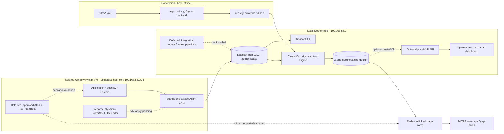

# AEGIS-VANGUARD

AEGIS-VANGUARD is a fully local SIEM-like SOC learning lab. Its goal is to demonstrate a portfolio-scale detection lifecycle: collect real telemetry, normalize it to ECS, convert Sigma rules into executable detections, create alerts, triage evidence, investigate related events, map results to MITRE ATT&CK, and document coverage and gaps.

This is **not** a production SIEM, commercial SIEM, commercial EDR, enterprise SOC platform, or claim of enterprise-scale coverage.

The core question is:

> Given one approved Atomic Red Team test executed against an isolated Windows VM, can the local pipeline collect the relevant telemetry, alert on it, and produce enough evidence to explain what was detected or missed?

That question is **not yet answered**. No alert has ever been produced.

## Current State

The lab is partly built and partly planned. The table below is the honest summary; the detail is in `CONTEXT.md`.

| Area | Capability status | Evidence |
| --- | --- | --- |
| Local lab foundation | `Runtime verified` | `docs/phase-0-environment.md` |
| Elastic Stack `9.4.2` deployment | `Runtime verified` | `infra/elastic/docker-compose.yml`, `scripts/verify-elastic.ps1` (18/18 pass) |
| Elasticsearch authentication | `Runtime verified` | Unauthenticated requests are rejected with HTTP 401, asserted by `verify-elastic.ps1` |
| Baseline Windows ingestion (Application/System/Security) | `Runtime verified`, **re-verification pending** | `docs/phase-2-windows-agent.md`; verified `2026-07-29` before authentication was enabled |
| Advanced telemetry (Sysmon/PowerShell/Defender) | `Implemented` | `infra/sysmon/sysmon-aegis.xml`, `docs/phase-3-advanced-telemetry.md`; not applied in the VM |
| ECS normalization, `system.*` | `Runtime verified` | System integration `2.22.1` installed; `event.kind` and `event.outcome` confirmed on a real document. See `docs/ecs-normalization.md` |
| ECS normalization, Sysmon / PowerShell / Defender | `Future` | Blocked: Windows integration `3.9.0` is incompatible with Elasticsearch `9.4.2`. Verified not to be a lab misconfiguration |
| Executor error handling | `Runtime verified` | A missing index yields `partial failure`, a malformed query yields `failed`, and neither fabricates an alert |
| Sigma conversion | `Unit tested` | `rules/`, `sigma/pipelines/aegis-lab.yml`, `scripts/convert-sigma.ps1` |
| Detection rule query logic | `Unit tested` | `scripts/test-detection-rules.ps1`, 44 fixture cases across 7 rules |
| Ingest-time payload decoding | `Runtime verified` | `infra/elastic/ingest-pipelines/aegis-powershell-decode.json`; live events carry `aegis.powershell.decoded_command` |
| Detection tuning | `Runtime verified` | `docs/detection-tuning-log.md`, TUNE-001 to TUNE-004, each with before/after measurement |
| Detection rule deployment and execution | `Runtime verified` | `scripts/verify-detection-rules.ps1`; 7 rules enabled and executing |
| Detection of real activity | `Runtime verified` | Detected evidence bundles in `evidence/`, each one alert correctly attributed to one source event |
| Atomic Red Team gap analysis | `Runtime verified` | `docs/atomic-validation-gap-analysis.md`; 5 procedures run, misses proven deterministically, 3 reproducible gaps closed and each re-verified live |
| MITRE coverage and gap analysis | `Runtime verified` | `mitre/coverage.md`, generated from evidence by `scripts/build-coverage.ps1` |
| Alert deduplication | `Runtime verified` | One source document queried by three consecutive rule executions produced exactly one alert |
| T1547.001 Run key rule vs Atomic test #1 | **`Live verified`** | `evidence/AEGIS-SCN-0005.md`, `docs/scenario-alignment-t1547-001.md`. This exact rule-scenario pair only |
| T1027 char-array rule vs Atomic test #11 | **`Live verified`** | `evidence/AEGIS-SCN-0010.md`, `TUNE-002`. Found as a miss, closed, then re-verified live. This exact pair only |
| T1218.010 non-registrable regsvr32 vs Atomic test #4 | **`Live verified`** | `evidence/AEGIS-SCN-0011.md`, `TUNE-004`. Miss closed by a new rule, re-verified live. This exact pair only |
| T1027 cradle plaintext arm vs Atomic test #3 | **`Live verified`** | `evidence/AEGIS-SCN-0012.md`, `TUNE-003`. Miss closed by extending the cradle rule, re-verified live. This exact pair only |
| Every other rule-scenario pair | `Runtime verified` | Benign marker runs, where the same author wrote both the rule and the trigger |
| Optional post-MVP API/dashboard | `Future` | No artifact planned before MVP |
| Portfolio packaging | `Runtime verified` | `docs/portfolio-report.md`: claim-to-evidence table, demo runbook, and the weaknesses a reviewer should press on |
| Suricata network telemetry | `Runtime verified` (pipeline only) | `scripts/analyze-network-telemetry.ps1`; PCAP to `logs-suricata.eve-aegis_lab`. Real VM capture still `Future` |
| Wazuh host log / FIM | `Runtime verified` (deployment only) | `infra/wazuh/docker-compose.yml`; manager running, 11 components. Agent on the victim VM still `Future` |
| Kafka transport | `Runtime verified` | `scripts/verify-kafka-transport.ps1`; 15 real alerts round-trip byte-identical |
| Detections from Suricata, Wazuh, or Kafka | `Future` | **None of the three has produced a detection.** Every detection still comes from Sysmon via Elastic |

All coverage, false-positive-rate, MTTD, and gap-closure metrics are `Not measured yet`.

### What the detections do and do not prove

Proven: seven Sigma rules convert, deploy, and execute in Elastic Security. Several matched
real telemetry produced by a live Windows VM, and each detection is captured in an evidence
bundle that links one alert to one source document, with the query window, rule version,
timestamps, and a SHA-256 of the raw export.

Four pairs are `Live verified` by external Atomic Red Team tests. The strongest story is the
gap loop: an Atomic run against the whole pack found four real procedures missing. Three were
reproducible and were closed — a new char-array rule (T1027 #11), a new non-registrable
regsvr32 rule (T1218.010 #4), and a plaintext arm added to the cradle rule (T1027 #3) — each
with before/after measurement and each re-verified live on a faithful re-run
(`docs/atomic-validation-gap-analysis.md`, `TUNE-002` to `TUNE-004`). The fourth non-detection
(T1059.005 #1) is a correct scope boundary, kept as a miss on purpose.

Not proven: that any of this survives an attacker who is trying to evade it. Four Atomic tests
of four procedures are not coverage of a technique, and `T1547.001` alone has 20 defined tests.
Each rule detects one shape, not the technique; the tuning log names the evasions that still
work against the new rules.

The rules have already produced their first operational false positives. This project's own
tooling drives the VM through `VBoxManage guestcontrol`, which invokes
`powershell.exe -EncodedCommand`, and the T1059.001 rule correctly flagged it. That is
recorded rather than tuned away, because the before-and-after is the interesting part.

## Core Flow

```text
Built
  Application / Security / System event logs
  -> standalone Elastic Agent 9.4.2
  -> Elasticsearch 9.4.2 (authenticated, host-only)
  -> Kibana 9.4.2

  Sigma rule
  -> sigma-cli + pySigma-backend-elasticsearch (siem_rule_ndjson)
  -> Elastic Security detection engine

Prepared, not applied
  Sysmon 15.21 / PowerShell Operational / Defender Operational

Not started
  required integration assets and ingest pipelines -> ECS verification
  approved Atomic Red Team test
  -> complete evidence bundle for one rule-scenario pair
  -> first result eligible for Live verified

Post-MVP
  expand to 3-5 rules -> coverage and gap analysis
  -> additional telemetry sources
  -> optional alert-triage API and dashboard
```

## Selected Versions

The version gate is closed. These exact versions are deployed and mutually compatible:

| Component | Version |
| --- | --- |
| Elasticsearch | `9.4.2` |
| Kibana | `9.4.2` |
| Elastic Agent (standalone) | `9.4.2` |
| Sysmon | `15.21` (prepared, not yet installed) |

## No Fixture-Based Capability Claims

Fixtures and unit tests are used only for syntax, parsing, conversion, and isolated logic checks. They must never be cited as detection evidence.

- A unit result may receive `Unit tested`; it cannot prove a runtime detection.
- Telemetry ingestion and ECS verification may reach `Runtime verified` only after the relevant readiness gates pass, real events are collected, source timestamps and host/Agent identity and ECS field groups are checked, and the corresponding evidence artifact is reviewed.
- Ingestion verification does not prove a detection rule works.
- Detection rule deployment and execution may reach `Runtime verified`; that is separate from, and much weaker than, evidence that a rule detects anything.
- Only a specific rule-scenario pair exercised by an approved Atomic Red Team test with a complete evidence bundle may receive `Live verified`.
- One scenario must never be generalized into a whole phase, platform, rule collection, or MITRE technique being live verified.
- Screenshots are supporting evidence only and require links to the corresponding query, source event, and scenario run.

## Status Model

Capability status and metric status are separate.

### Capability statuses

| Status | Meaning |
| --- | --- |
| `Future` | No implementation artifact exists. |
| `Implemented` | An artifact or configuration exists and is reviewable; runtime behavior is not yet proven. |
| `Unit tested` | Syntax, parsing, conversion, or isolated logic has been checked; this is not runtime or detection evidence. |
| `Runtime verified` | A controlled runtime smoke or manual validation has run on real telemetry; this is not evidence-backed detection coverage. |
| `Live verified` | One specific rule-scenario pair has been validated by an approved Atomic Red Team test with a complete evidence bundle. |

### Metric statuses

| Status | Meaning |
| --- | --- |
| `Not measured yet` | No sufficient evidence set exists for the metric. |
| `Measured` | The metric has a documented method, sample scope, and linked evidence. |

## Architecture

Solid lines are deployed. Dotted lines are prepared or deferred.


```mermaid
flowchart LR
  subgraph victim["Isolated Windows victim VM - VirtualBox host-only 192.168.56.0/24"]
    logs["Application / Security / System"]
    agent["Standalone Elastic Agent 9.4.2"]
    laterTelemetry["Prepared: Sysmon / PowerShell / Defender"]
    atomic["Deferred: approved Atomic Red Team test"]
  end

  subgraph host["Local Docker host - 192.168.56.1"]
    es[("Elasticsearch 9.4.2 - authenticated")]
    kibana["Kibana 9.4.2"]
    engine["Elastic Security detection engine"]
    alerts[(".alerts-security.alerts-default")]
    assets["Deferred: integration assets / ingest pipelines"]
    api["Optional post-MVP API"]
    dashboard["Optional post-MVP SOC dashboard"]
  end

  subgraph conversion["Conversion - host, offline"]
    sigma["rules/*.yml"]
    cli["sigma-cli + pySigma backend"]
    ndjson["rules/generated/*.ndjson"]
  end

  logs --> agent --> es --> kibana
  laterTelemetry -. VM apply pending .-> agent
  assets -. not installed .-> es
  atomic -. scenario validation .-> logs
  sigma --> cli --> ndjson --> engine
  es --> engine --> alerts
  alerts -. optional post-MVP .-> api
  api --> dashboard
  alerts --> triage["Evidence-linked triage notes"]
  atomic -. missed or partial evidence .-> triage
  triage --> report["MITRE coverage / gap notes"]
```

## Detection Executor

The Phase 2 architecture decision is resolved: the **Elastic Security detection engine** is the executor. Sigma rules are converted by `sigma-cli` into Elastic detection rules and imported through the Kibana API. No custom scheduler is written.

The decision, the evidence behind it, and the rejected alternative are recorded in `docs/adr-001-detection-executor.md`.

## Security Posture

| Control | State |
| --- | --- |
| Elasticsearch authentication | Enabled and enforced; verified by an HTTP 401 assertion |
| Elastic Agent credentials | Least-privilege API key: cluster `monitor`, plus `auto_configure` and `create_doc` on the lab data streams only |
| Network exposure | Elasticsearch and Kibana publish only on the host-only address `192.168.56.1`; no public exposure |
| Repository secrets | `infra/elastic/.env`, `.venv/`, `rules/generated/`, and test files are gitignored; API keys are printed once and never stored |
| TLS | **Deliberately not enabled.** A recorded, accepted gap - see `docs/adr-001-detection-executor.md`. Elastic no longer requires TLS for API keys or alerting, and the lab is confined to a host-only network. It must be revisited before any transport-security claim. |
| Cluster health | `yellow`, expected on a single node because replica shards are unassigned |

## Repository Layout

```text
infra/elastic/                Docker Compose for Elasticsearch + Kibana
infra/elastic-agent/windows/  Standalone Agent policy template (api_key placeholder)
infra/sysmon/                 Sysmon configuration
infra/elastic/component-templates/  Index mapping customisations
rules/windows/                Sigma rule sources
rules/tests/                  Fixture cases that guard rule query logic
sigma/pipelines/              Custom pySigma processing pipeline
scripts/                      Host-side setup, verification, evidence, coverage
scripts/lib/                  Shared credential handling
scripts/windows/              VM-side setup, rollback, markers, scenario driver
evidence/                     Scenario evidence bundles
mitre/                        Generated coverage matrix
docs/                         Phase records and architecture decisions
```

## Running It

Bring up the stack (requires `infra/elastic/.env`):

```powershell
docker compose -f infra\elastic\docker-compose.yml --env-file infra\elastic\.env up -d
.\scripts\verify-elastic.ps1
```

Create an Agent credential, then apply it inside the VM:

```powershell
.\scripts\new-agent-api-key.ps1
```

Convert and deploy detections:

```powershell
py -m venv .venv
.\.venv\Scripts\python.exe -m pip install -r requirements.txt
.\scripts\convert-sigma.ps1
.\scripts\deploy-detection-rules.ps1
.\scripts\verify-detection-rules.ps1
```

VM-side steps are manual and documented in `docs/phase-3-advanced-telemetry.md`.

## Environment

| Component | Location | Boundary |
| --- | --- | --- |
| Windows victim VM | Local VirtualBox host-only network | No bridged/public networking during scenarios |
| Elastic Stack and detection workflow | Local Docker host | Services run only in the resource mode needed for the approved task |
| Optional backend/dashboard | Local Docker host, post-MVP only | No public exposure; does not block MVP |

No cloud or publicly exposed attack environment is used.

## Resource Modes

The host was measured on `2026-08-02`: **61.7 GB total, 30.3 GB free** with the Elastic Stack and the victim VM both running. Earlier revisions of this file assumed a 16 GB laptop and staged the work around that constraint; the constraint does not exist, and the staging below is kept for discipline rather than necessity.

| Component | Figure | Basis |
| --- | --- | --- |
| Host total / free | 61.7 GB / 30.3 GB | Measured with the stack and VM running |
| Elasticsearch | `mem_limit: 4g` | Enforced by Compose |
| Kibana | `mem_limit: 2g` | Enforced by Compose |
| Windows victim VM | ~4 GB RAM | VM configuration, not measured |
| Suricata | ~1 GB RAM | Estimate; not deployed |
| Wazuh manager + indexer | ~4 GB RAM | Estimate; not deployed |
| Kafka | ~1.5-2 GB RAM | Estimate; not deployed |

Resource pressure is therefore **not** the reason Suricata, Wazuh, and Kafka are absent. The reason is stated in `PROJECT_PLAN.md`: the higher-value work is depth against the existing rules — running Atomic tests, closing the gaps they expose, and re-verifying live, as `docs/atomic-validation-gap-analysis.md` records — not more components that would make the project look broader and prove less.

| Mode | Use | Running components |
| --- | --- | --- |
| A - Rule development | Sigma syntax/conversion work | No live services required |
| B - Live ingestion | Telemetry and ECS verification | Victim VM + Elastic Stack |
| C - Scenario session | Approved Atomic validation | Victim VM + Elastic Stack + detection engine |
| D - Evidence review | Review stored alerts and evidence | Elastic Stack |
| E - Wazuh session | Post-MVP Wazuh work | Wazuh stack only |
| F - Kafka session | Optional stretch work | Kafka and required producer/consumer only |

Compose currently defines one profile covering modes B, C, and D. It does not yet enforce mode separation.

## Standalone Elastic Agent and Fleet Boundary

- One standalone Elastic Agent is used. Its policy and binary lifecycle are managed manually.
- Fleet-managed enrollment and Fleet Server are deferred. Fleet Server is not a prerequisite for this flow.
- The Agent authenticates with an API key. The committed policy carries a placeholder; the real key is applied only inside the VM.
- Required ingest pipelines, index templates, and other integration assets are **not** installed. Documents therefore carry raw `winlog.*` fields rather than the full ECS field set, which is why `sigma/pipelines/aegis-lab.yml` matches both field shapes.

## Operating Flow

1. ~~Complete and evidence the isolation and resource prerequisites.~~ Done.
2. ~~Pass the version, resource, network, secret-handling, and rollback gates.~~ Done, except TLS, which is a recorded accepted gap.
3. ~~Select the detection executor.~~ Done - see ADR-001.
4. Apply the Agent API key and advanced telemetry in the victim VM, then re-verify ingestion under authentication.
5. Install and verify integration assets, then verify ECS field groups and populate `normalization/ecs_mapping.md`.
6. Produce the first alert from benign marker activity.
7. Review the telemetry-rule-scenario alignment, obtain approval for the exact Atomic Red Team run, execute it, and produce the first complete rule-scenario evidence bundle.
8. Create the first evidence-backed coverage entry and gap/validation note.
9. After MVP, expand to 3-5 rules and consider additional telemetry and the optional API/dashboard workstream.

## Ethics and Safety

- Attack emulation requires explicit approval for the exact run and is limited to the isolated host-only lab.
- The victim VM must never use bridged/public networking for scenario execution.
- Elasticsearch, Kibana, APIs, and dashboards must never be exposed publicly.
- No capability status or metric may be upgraded without its required linked evidence.
- Credentials, tokens, personal data, and sensitive machine identifiers must be redacted from repository evidence.

## What This Project Does Not Claim

- A production or managed SIEM.
- A commercial SIEM or EDR.
- An enterprise SOC platform.
- Enterprise-scale telemetry or detection coverage.
- That any detection rule has detected anything.
- Any detection result, coverage value, or other metric without linked evidence.

## Documentation Ownership

- `README.md`: project identity, current repository state, architecture summary, status model, resource modes, safety boundaries, and roadmap link.
- `PROJECT_PLAN.md`: roadmap, gates, dependencies, success criteria, evidence requirements, and future work.
- `CLAUDE.md`: agent behavior, methodology, and approval boundaries.
- `CONTEXT.md`: non-authoritative working state, approved decisions, blockers, changed files, validation results, and next approved step.
- `docs/adr-*.md`: architecture decision records.

## Roadmap

See `PROJECT_PLAN.md`. Note that `PROJECT_PLAN.md` still describes several gates as unresolved that this README records as closed; it needs its own sync pass.
